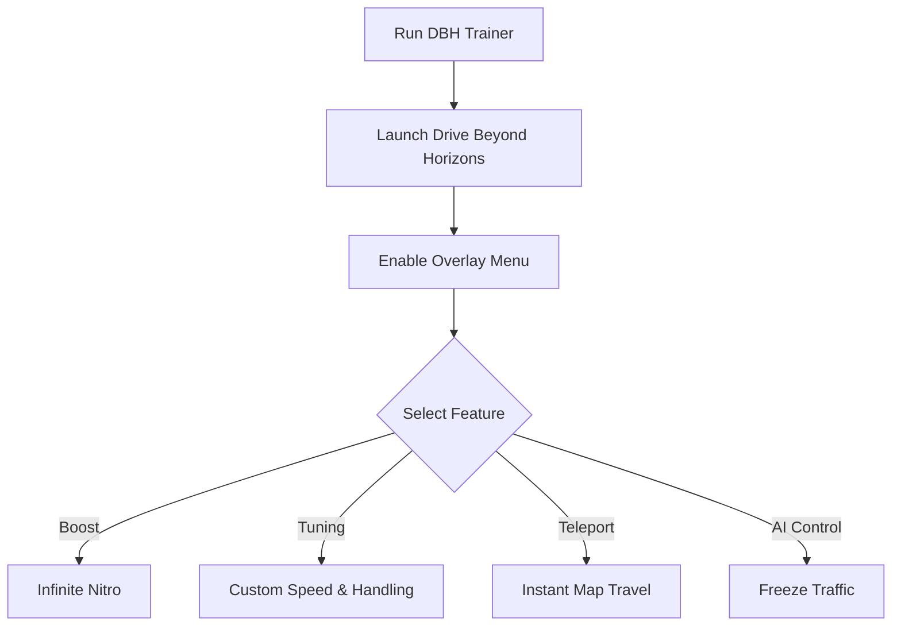

# Drive Beyond Horizons Trainer 🛠️

The **Drive Beyond Horizons Trainer Software** gives players full control over their driving experience. With real-time overlays, hotkey toggles, and customizable configs, you can adjust performance, unlock boosts, and test vehicle setups instantly.

[](#)
[](#)
[](#)
[](#)

---

## 📝 Overview

Drive Beyond Horizons is built for exploration and speed, but sometimes you want to **train mechanics, test performance, or push cars beyond limits**. The trainer offers **infinite boost, vehicle tuning, and teleport functions**, making it ideal for practice, sandbox sessions, or stress-free cruising.

\[!IMPORTANT]
This trainer works in memory only and doesn’t permanently modify your game files.

---

## ⭐ Features

* **Infinite Boost/Nitro** – Drive without fuel or stamina limits.
* **Vehicle Tuning** – Modify acceleration, suspension, and top speed.
* **Teleport Anywhere** – Instantly jump to checkpoints or map markers.
* **Freeze AI Traffic** – Stop NPC cars for clean testing sessions.
* **Overlay Menu** – Manage all trainer modules in-game.
* **Hotkey Profiles** – Save and load different driving setups.

---

## 🖥 Compatibility

| Platform           | Supported | Notes                         |
| ------------------ | --------- | ----------------------------- |
| Windows 10/11      | ✅         | Fully supported               |
| Steam              | ✅         | Stable overlay integration    |
| Linux (Proton)     | ⚠️        | Experimental, requires tweaks |
| Consoles (Xbox/PS) | ❌         | Not supported                 |

\[!NOTE]
Accessibility: Trainer overlay supports scalable fonts, color themes, and controller-friendly navigation.

---

## ⚡ Setup Guide

1. **Download** the trainer package.
2. Extract files into your Drive Beyond Horizons installation folder.
3. Run `DBHTrainer.exe` as administrator.
4. Launch the game and press `F1` to activate the overlay.
5. Toggle features via hotkeys or on-screen menu.

```ini
[trainer]
boost=on
top_speed=380
acceleration=1.6x
teleport=true
hotkey_overlay=F1
hotkey_boost=F2
```

---

## 🔄 Trainer Workflow



---

## ❓ FAQ

**Q: Can I use the trainer online?**
A: No, it is intended for **offline and private sessions** only.

**Q: Does it overwrite saves?**
A: No, all changes are temporary and revert after you close the trainer.

**Q: Can I remap hotkeys?**
A: Yes, all functions are fully configurable in `config.ini`.

**Q: Will it reduce FPS?**
A: Very minimal—the trainer is lightweight and optimized.

**Q: Can I save different setups?**
A: Yes, profiles let you load custom configs for multiple cars.

---

## 🚀 Final Thoughts

The **Drive Beyond Horizons Trainer** combines **boost control, vehicle tuning, teleport tools, and overlays** into one easy-to-use package. It’s the perfect choice for **testing builds, practicing mechanics, or exploring maps without limits**.

---


